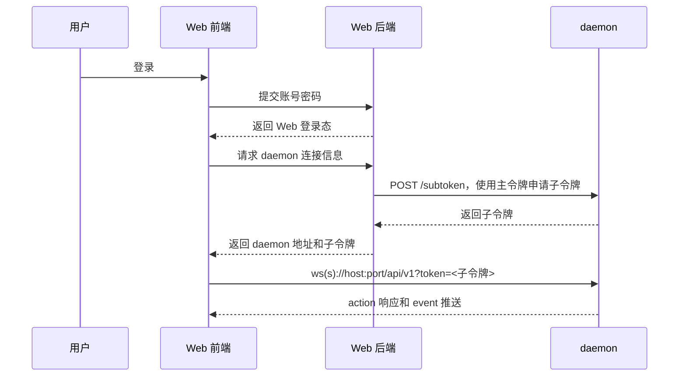

# Web 用户系统

当前 `MCServerLauncher-Future` C# daemon 不内置 Web 用户系统。daemon 只负责校验主令牌和子令牌，并根据 token 中的权限字符串执行 action 权限检查。

Web 前端或其他外部服务如果需要用户、密码、刷新令牌、多用户管理等能力，应在自己的后端中实现，然后使用 daemon 主令牌申请权限受限的子令牌。

## 当前 daemon 支持的鉴权能力

- 主令牌来自 daemon 配置。
- 子令牌通过 `POST /subtoken` 申请。
- 子令牌是 JWT。
- WebSocket 连接通过 `?token=<令牌>` 传入 token。
- action handler 使用权限节点检查当前连接是否允许执行。

## 推荐外部 Web 流程

## 不属于当前 daemon 协议的内容

以下内容不是当前 C# daemon 内置协议的一部分：

- 用户注册和登录。
- 密码哈希和刷新令牌。
- 多用户权限管理 UI。
- Web 会话状态。
